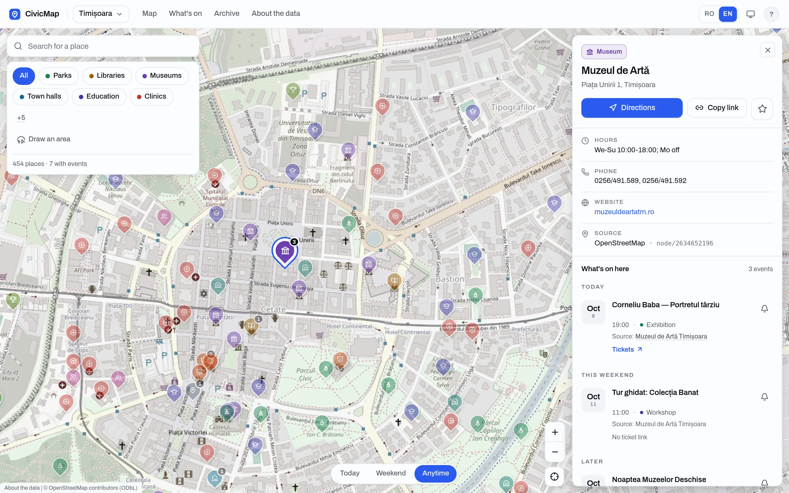
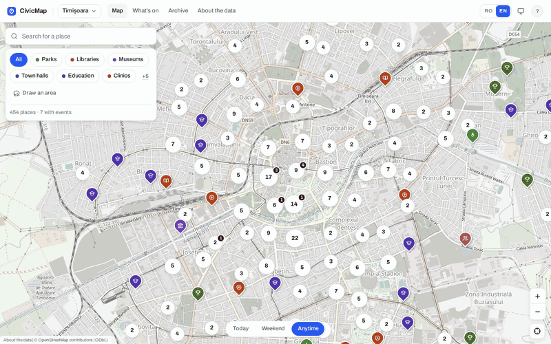
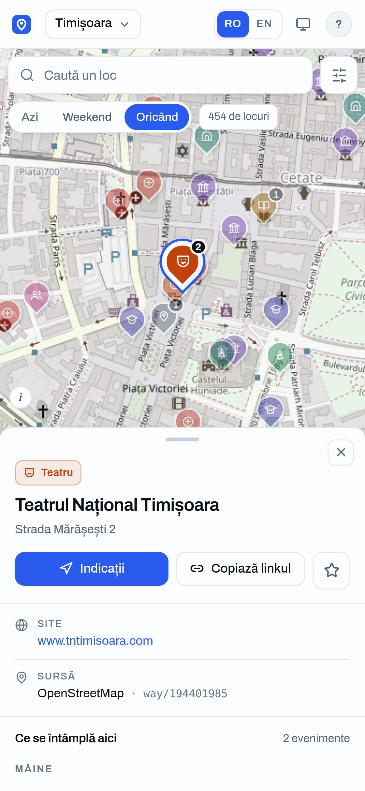
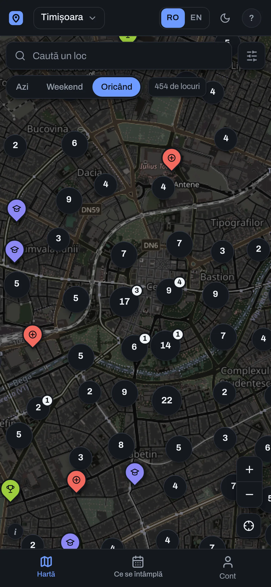
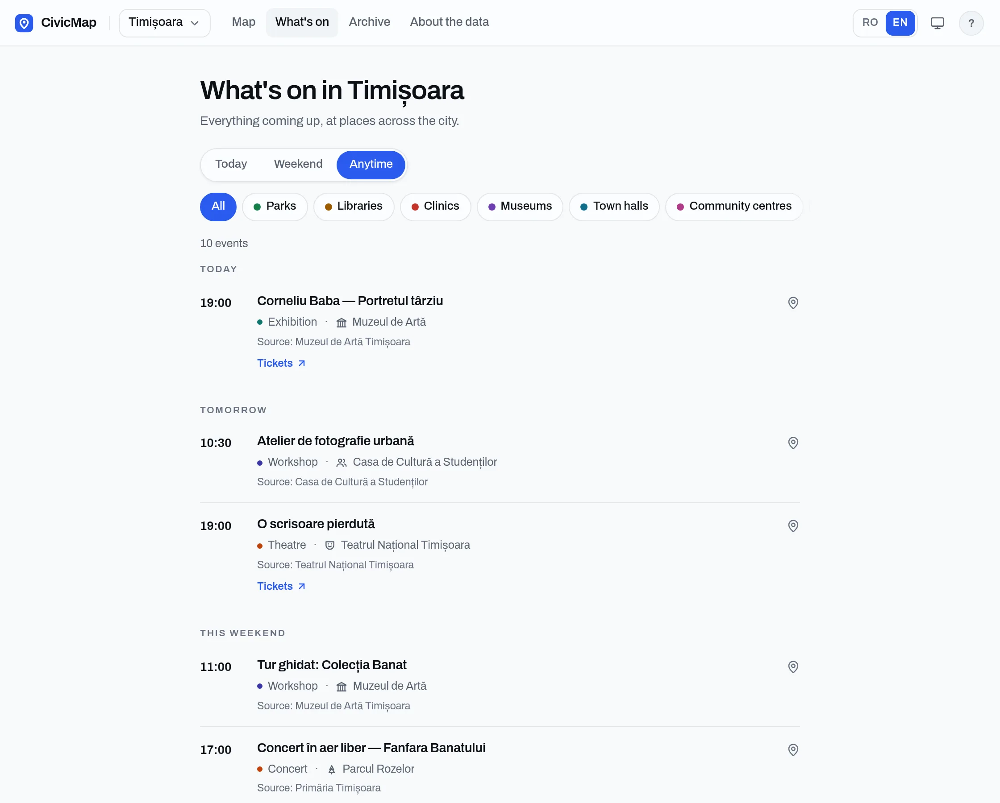

# Public Resource Map

A map of the parks, libraries, clinics, museums, town halls and other public places in Timișoara and București that shows what is on at each one. It is for residents asking "what is near me, and is anything happening there?" On screen the app calls itself CivicMap.

<p align="center">
  
</p>

**Status:** Proof of concept, deployed at <https://gandolh.ro/prm/> since 2026-10-07. On 2026-10-09 the live database had no places loaded yet, so the pictures here come from a local copy running the seed data. The places are real OpenStreetMap data; every event is synthetic until the first real event feeds are added.

## What it does

- Puts each city's public places on one map, from OpenStreetMap, with pins clustered so the whole city stays readable.
- Opens a place to show what is on there, grouped Today, Tomorrow, This weekend and Later. A ticket link appears only when the publisher gave one.
- Lists everything coming up in the city on a What's on page, and past events on an Archive page.
- Filters by category, by timing and by an area you draw on the map. The same filters drive the map and the list.
- Lets a signed-in user follow places and save events, then sends an in-app and email notice when a followed place gets a new event, and a reminder the day before a saved one.
- Holds events from public calendar feeds in an admin review queue until a person accepts them.

Most event apps are a feed of listings with a map added on, and a listing disappears once it is over. Here the place is what you look at, so the map is still useful in a week when nothing is on. Events come only from the venues' and the city's own published calendars, never from a ticket seller's site. It covers two cities and does not sell or book anything.

## Screenshots

<p align="center">
  
</p>

In the GIF: pick the Museums chip, zoom in, drag the map, then click a pin to open the place.

| A place on a phone, in Romanian, the default language | The city map in the dark theme |
|---|---|
|  |  |

| What's on: everything coming up in the city, by day |
|---|
|  |

## How it works

Three npm workspaces. `shared` holds the Zod schemas and types that both sides compile against. `backend` is a Fastify API on SQLite through Drizzle ORM; it serves places and events, runs the OpenStreetMap sync and the event pipeline, and sends the daily reminders. `ui` is a React single-page app built on React Router, Leaflet and TanStack Query, served under `/prm/`. Sign-in belongs to Ward, the shared sign-in service the owner's apps use; prm checks Ward's tokens and grants and stores no passwords or email addresses.

Places and events reach the map by different routes:

<p align="center">
  
</p>

An admin runs an OSM sync per city, and it writes places directly. Events come from public calendar feeds; iCal is the one adapter built so far. Each event's venue name is matched to a place, geocoded with Nominatim only when no place matches, and staged. A person accepts or rejects every staged event before it shows on the map.

More on the docs site: [architecture](https://gandolh.ro/prm/docs/wiki/architecture/), [ingestion](https://gandolh.ro/prm/docs/ingestion/), [HTTP API](https://gandolh.ro/prm/docs/api/) and [data model](https://gandolh.ro/prm/docs/data/).

## Run it locally

Requires Node 24; tested with 24.14. The public map needs nothing else. Signing in needs a local Ward, which [docs/getting-started.md](docs/getting-started.md) covers.

```bash
npm install
cp .env.example .env
npm run build -w shared                                       # the other workspaces import its build
npm run db:migrate -w backend && npm run db:seed -w backend   # offline: both cities' OSM places + synthetic events
npm run dev                                                   # API on :3001, app on :5173
```

Then open <http://localhost:5173/prm/>. Env vars, sign-in, the admin, tests and the docs site: [docs/getting-started.md](docs/getting-started.md).

## Project layout

| Path | What lives there |
|---|---|
| `shared/` | Zod schemas and the TypeScript types the app and API share |
| `backend/` | Fastify API, database schema and migrations, OSM sync, event pipeline, seed |
| `ui/` | The React app, plus [PRODUCT.md](ui/PRODUCT.md) on who it is for and [DESIGN.md](ui/DESIGN.md) with the design system |
| `e2e/` | Playwright tests, with a stand-in Ward |
| `docs/` | The Starlight docs site, and the images in this README |
| `corpus/` | The project wiki: decisions, status and the briefs that built it |
| `infrastructure/` | Dockerfile and Compose file the deploy builds the API from |

## Docs

- [docs/](docs/README.md): local setup, the docs-site sources, and the images used here
- Docs site: <https://gandolh.ro/prm/docs/>, built from `docs/`
- Project wiki: [corpus/](corpus/index.md), with the decisions, the current status and the briefs

## License

[MIT](LICENSE)
